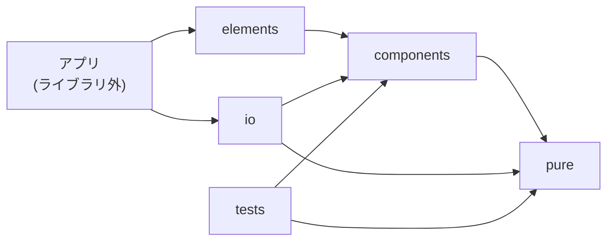

# nijiurachan-js Birdseye

本ドキュメントは、`nijiurachan-js` の全体像、依存関係、読み順、ホットスポットを把握するための俯瞰入口である。

## 1. このリポジトリは何か

`nijiurachan-js` は、`AI_BBS/ts` と `aimg_viewer` の両方から利用されるフロントエンド共通部品基盤である。
名前は `js` だが、実体は TypeScript / Preact / CSS / Custom Elements を中心とした共有ライブラリである。

Phase 1 では新スマホ版の共通部品供給元、Phase 3 では PC 版 V2 の共通基盤、Phase 4 では PC / SP 統合版 V3 の再利用資産として位置づける。

## 2. 依存構造

このライブラリはフォルダでモジュール分けしている。
責務をあいまいにしないため、下の関係のまま循環させずに保つこと。

## 3. 主なディレクトリと責務

| 領域 | 主ディレクトリ | 役割 |
| --- | --- | --- |
| build | `src/build/*` | ビルド、watch、postinstall、index 生成 |
| elements | `src/elements/*` | Custom Elements 定義、DOM 入口 |
| components | `src/components/*` | Preact コンポーネント |
| io | `src/io/*` | 外部部品との接続、入出力の橋渡し |
| pure | `src/pure/*` | DOM や通信を持たない純粋ロジック |
| util | `src/util/*` | 汎用イベント・補助ユーティリティ |
| test | `src/test/*` | 設計思想に沿ったユニットテスト |

## 4. ホットスポット

- `src/README.md`
  - 現状の依存方向と設計思想の中心
- `src/elements/lazy-turnstile.ts`
  - 外部スクリプト読み込みとフォーム連携の代表例
- `src/elements/upfile-input.ts`
  - Custom Elements と Preact 断片の接続例
- `src/pure/upfile.ts`
  - UI 状態遷移の純粋ロジック
- `src/test/upfile/*.test.ts`
  - 現在のテスト思想が最も見える領域

## 5. 文書の責務分担

| 文書 | 役割 |
| --- | --- |
| `docs/README.md` | docs 入口、読み順 |
| `docs/BIRDSEYE.md` | 俯瞰、ホットスポット |
| `docs/requirements/SHARED_UI_FOUNDATION_REQUIREMENTS.md` | 共通基盤の要件 |
| `docs/specs/ARCHITECTURE_PHASE1_TO_PHASE4.md` | Phase 1 / 3 / 4 を受ける設計方針 |
| `docs/specs/FOUNDATION_BOUNDARY_MATRIX.md` | 共通基盤に残す責務と外へ出す責務の整理 |
| `docs/operations/IMPLEMENTATION_BOTTLENECK_REVIEW.md` | 共通基盤として崩れやすい箇所のレビュー |
| `docs/implementation/TEST_DESIGN.md` | 確認観点 |
| `docs/implementation/REACT_BRIDGE_PREACT_WRAPPER_V1.md` | React 側橋渡し `PreactWrapperV1` と connector パターンの説明書 |
| `docs/implementation/AIMG_VIEWER_UPFILE_INPUT_V2_HANDOFF.md` | aimg_viewer 統合の具体手順 (upfile-input-v2) |
| `docs/operations/RUNBOOK.md` | 更新時、公開時、利用時の運用判断 |

## 6. 次に固めるべきもの

1. `AI_BBS/ts` と `aimg_viewer` のどこまでを共通基盤へ寄せるか
2. Preact / Custom Elements と React クライアントの境界
3. Turnstile、添付入力、イベント連携の共通契約
4. `pure` に逃がすべき状態遷移ロジックの整理
