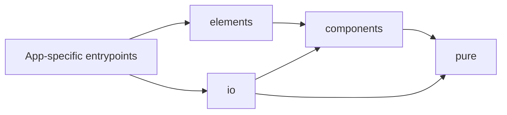

# アーキテクチャ方針: Phase 1 から Phase 4 まで

本ドキュメントは、`nijiurachan-js` を Phase 1 / 3 / 4 の共通基盤として維持するための設計方針を定義する。

## 1. 方針

- 現在の TypeScript / Preact / Custom Elements の構成を維持する
- ただし、特定クライアント専用のロジックで repo を肥大化させない
- 画面全体ではなく、小さい再利用単位を蓄積する

## 2. 目標構造

## 3. 層ごとの責務

### 3.1 elements

- DOM の入口
- Custom Elements の登録
- lifecycle 処理
- Preact mount の橋渡し

### 3.2 components

- Preact コンポーネント
- 表示とイベント受理
- `io` と `pure` の利用

### 3.3 io

- 外部部品との接続
- 既存 JS / イベント連携
- popup、paint、外部入力、環境差分の吸収

### 3.4 pure

- 状態遷移
- 判定
- 値の組み立て
- DOM や通信に依存しないロジック

## 4. Phase 別の役割

### 4.1 Phase 1

- 新スマホ版で再利用できる入力 / 補助部品の供給
- `aimg_viewer` と直接共有できない場合でも、`pure` と契約を再利用できる構造を保つ

### 4.2 Phase 3

- PC 版 V2 の共通 UI 下層として機能する
- `AI_BBS/ts` の移行先として残せる部品を優先する

### 4.3 Phase 4

- PC / SP 統合版 V3 の下層資産として、イベント契約、入力契約、純粋ロジックを使い回せること

## 5. いま避けるべきこと

- 画面全体の責務をこの repo に持ち込むこと
- クライアント固有の router / store / page ロジックを入れること
- `pure` に DOM や通信を持ち込むこと
- 既存 JS をそのまま居座らせるための延命層にすること

## 6. いま優先すべきこと

- Turnstile、添付入力、イベント契約のような横断部品を整理する
- `pure` の状態遷移を増やして再利用を高める
- React 系クライアントから直接使えない部品でも、純粋ロジックと契約は共有可能にする

## 7. テスト方針

- 本段階では設計レベルの確認観点に止める
- `pure` を中心に確認し、`elements` / `components` は契約通りに `pure` を呼ぶかを確認対象にする
