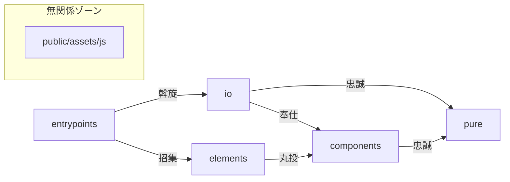
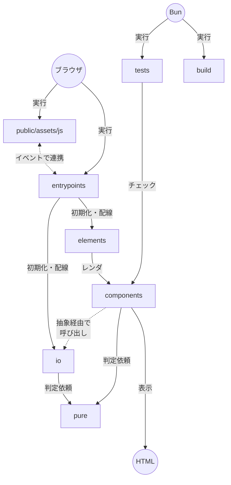

# このフォルダについて

- TypeScriptソースをここに置きます

## 各モジュールの依存関係

下の感じでお願いします

## 各モジュールの呼び出し関係

こんな感じです

### モジュールの役割分担

- PHPからはscriptタグでentrypointsのどれかを読み込みます
- entrypointsはioを初期化して、elementsのdefineを呼び出します
- elementsはカスタムエレメントを定義します
- componentsはelementsにマウントして使うPreactコンポーネントを定義します
- elementsやcomponentsはイベントを受け取り、entrypointsから渡されたioを呼び出します
    - elementsやcomponentsではよそに依頼したい仕事(表示でもイベントでもない処理)をインターフェイスとして定義します
    - io側でインターフェイスを実装します
    - DIPでググってね
- elements・components・ioは適宜pureに判断を仰ぎ、pureの指示を実行します
- testsはcomponentsやioがちゃんとpureの指示通り動いているか確認します
- testsはpureが意図通りになっているか確認します

## 開発Q&A

### Bunをインストールしないとだめですか？

- dockerが自動でコンパイルするように設定してるので入れなくても大丈夫です
- 個別のコマンドも使えます
    1. `docker-compose run --rm bun fix` でフォーマット
    2. `docker-compose run --rm bun tsc` で型チェック
    3. `docker-compose run --rm bun vitest` でテスト
    4. `docker-compose run --rm bun clean` でビルド物を掃除
- もちろんインストールしたほうが動作は軽いと思います

### どうやってコンパイルするんでしょう？

- 前項の通りdockerが自動でやってくれます
- 手元で実行したい場合は、bunコンテナを止めて `bun dev` してください

### TSって実際どこにコンパイルされるんですか？

- 主に下2ファイルです
    1. `public/assets/js/ts/pc.js`
    2. `public/assets/js/ts/sp.js`

### VSCodeのおすすめ設定とかあります？

- おすすめ拡張機能に出てくるやつは全部おすすめです (`.vscode/extensions.json`を参照)
- フォーマッタ(Biome)が保存時に走るように設定することをおすすめします
    - `.vscode/settings.json.example`を`.vscode/settings.json`にコピーしてご利用ください
- このあたりはたぶんbunをOSにインストールしないとだめですね

### 新機能ってどこに置けばいいですか？

- elementsにとりあえず置いてください
    - 余裕があれば上のモジュール分担通りにioやpureに分割したりしてテストしていきます

### カスタムエレメントって書いたことないんですがどうやるんでしょう？

- 入口が`DOMContentLoaded`でなく`connectedCallback()`になるだけですね
- 別にクラスの外に関数を置いてもいいので普通のJSと同じ調子でやって大丈夫です

## 設計思想Q&A

### このTSソースは今後も使うのでしょうか？

- 捨てる予定の部分と捨てない予定の部分があります
- 基本的にはPC版の新フロントエンドでも使える小さい部品を残していくイメージです
- スマホ版はReactで作り直し後JS丸ごと捨てる予定ですが、バグ修正など手を入れる時にTSになるべく移動してから作業します (型チェックが欲しい)

### 既存JSはどうします？

- TSからJSを呼び出したりJSからTSを呼び出したりする事はやりません (JSの寿命が伸びちゃうので)
- 利用したいJSをioに移動して文法エラーを直す感じで取り込んでいきましょう
- やむを得ずJSとTSでやり取りが必要な場合はカスタムイベントで連携してください
    - やむを得ない例1: JSが巨大すぎて大手術になるため一気に移動したくない
    - やむを得ない例2: JSを他プルリクエストで手を入れている最中で、今すぐ移動すると衝突しそう
    - カスタムイベントの一覧は ts/components/types.ts にあります

### 新規JSは追加していいですか？

- 完全な新機能の場合: TSでやりましょう
- JSに手を加えたい場合: TSにまず持ってきて、そこから手を加えましょう
    - `connectedCallback()`がJSのDOMContentLoadedと同じタイミングで呼ばれるので、そこから初期化処理を呼べば同じ動きになるはずです
- 後々の移行引っ越しが楽になるのでお手数ですがお願いします

### なぜカスタムエレメント？

- ううｎの好みです (開発ツールでタグ横のボタンをクリックするとソースに飛べるところが好き)

### Reactにしないのですか？

- PHP側であれこれレンダリングしちゃってるので、表示を丸ごと引っ越すのは労力が割に合わなそうです
- Preactをエレメントごとにちまちま導入して練習していこうと思います
- zustand/vanillaもそのうち使ってみたいです

### index.tsが全然ないですね？

- ビルド時`export *`が並んだindex.tsが自動で生成されます
- ううｎの好みです (フォルダ構造をよく雑に移動するので便利)
